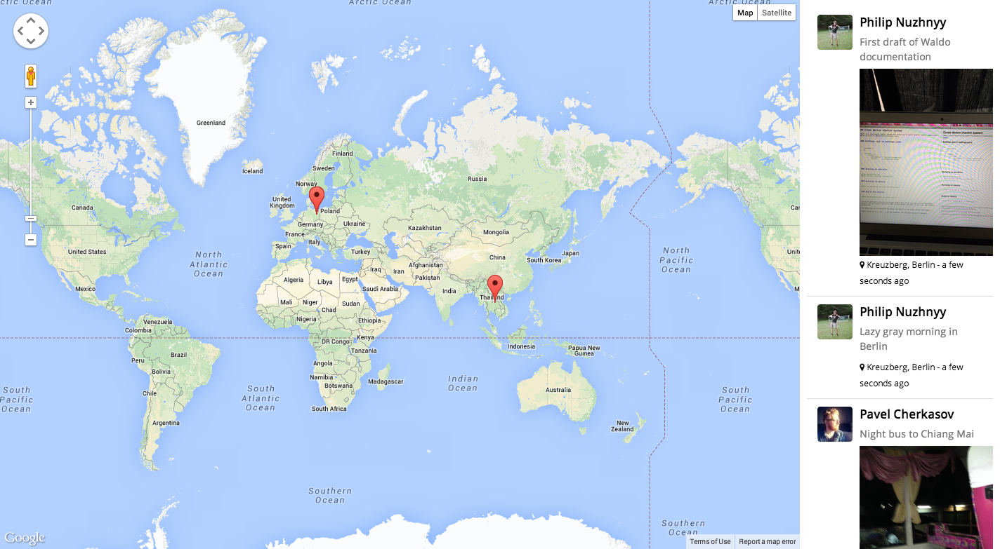

Waldo is a cross device checkin system that allows you to build location centric communities. Waldo is built on [Meteor](http://meteor.com).   

## What it looks like


*list of checkins on mobile*


*checkin interface on mobile*



*desktop dashboard tracking checkins in real time*

## How to configure

You will need two configuration files to configure Waldo - settings.json for development settings and production.settings.json for production. Both files have the same format

```
{
    "cordova":{ 
    },
    
    "public" : {
        "foursquare" : {
            "clientId" : "<FOURSQUARE_APPLICATION_KEY>",
            "clientSecret" : "<FOURSQUARE_APPLICATION_SECRET>"
        },
        
        "facebook": {
            "permissions": [
                "public_profile"
            ],
            "profileFields": [
                "name"
            ]
        },

        "checkins": {
            "limit": <NUMBER_OF_LATEST_CHECKINS_TO_DISPLAY>
        } 
    },
    
    "private" : {
        "facebook" : {
            "applicationId" : "<FACEBOOK_APPLICATION_ID>",
            "applicationSecret" : "<FACEBOOK_APPLICATION_SECRET>"
        },

        "imugr" : {
            "apiKey" : "<IMUGR_API_KEY>"
        }
    }
}
```

## Running Waldo
 
To run a local version of the dashboard on your browser

```
meteor --settings settings.json
``` 

To run an iOS mobile version of the app on your device/emulator

```
meteor run ios-device -p <local IP>:<local port>
```

## Building and deploying Waldo

Push Waldo to Meteor

```
meteor deploy <name-of-your-fork>.meteor.com --settings production.settings.json
```

Build Waldo for iOS

```
meteor build <output-path> --server <name-of-your-fork>.meteor.com  
```

## Get involved

**Waldo is work in progress**. We currently have an iOS version of Waldo on our TestFlight. You can jump in and [help us test it](http://tflig.ht/1u1EKcD).    